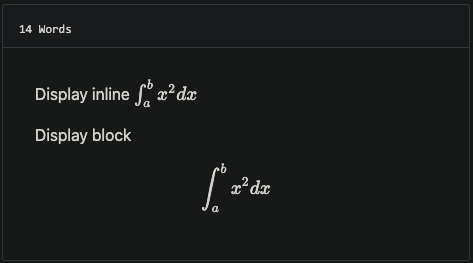

# github-style

## Init hugo site

```bash
hugo new site mysite
cd mysite
```

## Install the theme

```bash
git submodule add git@github.com:MeiK2333/github-style.git themes/github-style
```

## Update the theme

If you just installed the theme, it is already in the latest version. If not, you can update using the below commands

```bash
cd themes/github-style
git pull
```

Then, you need to rename the previous `posts` folder to `post`

```bash
cd <you-project-folder>
mv content/posts content/post
```

## Setup readme

```bash
hugo new readme.md
echo '`Hello World!`' > content/readme.md
```

## Pin post

```
---
pin: true
---
```

## Add new post

Hugo will create a post with `draft: true`, change it to false in order for it to show in the website.

```
hugo new post/title_of_the_post.md
```

## Limit display content

### Approch 1: use summary

```
---
title: "title"
date: 2019-10-22T18:46:47+08:00
draft: false
summary: "The summary content"
---
```

### Approch 2: use `<!--more-->`

Use `<!--more-->` to seperate content that will display in the posts page as abstraction and the rest of the content. This is different from summary, as summary will not appear in the post.
```
---
title: "title"
date: 2019-10-22T18:46:47+08:00
draft: false
---
abstraction show in the post page
<!--more-->
other content
```

## add last modified data

add to `config.toml`

```toml
lastmod = true

[frontmatter]
  lastmod = ["lastmod", ":fileModTime", ":default"]
```

## Use [gitalk](https://github.com/gitalk/gitalk) to support comments

add to `config.toml`

```toml
enableGitalk = true

  [params.gitalk]
    clientID = "Your client ID" 
    clientSecret = "Your client secret" 
    repo = "repo"
    owner = "Your Github username"
    admin = "Your Github username"
    id = "location.pathname"
    labels = "gitalk"
    perPage = 30
    pagerDirection = "last"
    createIssueManually = true
    distractionFreeMode = false
```

## Support LaTex

In you post add `math: true` to [front matter](https://gohugo.io/content-management/front-matter/)

```
---
katex: math
---
```

Then the [katex script](https://katex.org/docs/autorender.html) will auto render the string enclosed be delimiters.

```
# replace ... with latex formula
display inline \\( ... \\)
display block $$ ... $$
```



## config.toml example

```toml
baseURL = "https://meik2333.com/"
languageCode = "zh-cn"
title = "MeiK's blog"
theme = "github-style"
googleAnalytics = "UA-123456-789"
pygmentsCodeFences = true
pygmentsUseClasses = true

[params]
  author = "MeiK"
  description = "In solitude, where we are least alone."
  github = "MeiK2333"
  facebook = "MeiK2333"
  twitter = "MeiK2333"
  linkedin = "MeiK2333"
  instagram = "MeiK2333"
  tumblr = "MeiK2333"
  email = "meik2333@gmail.com"
  url = "https://meik2333.com"
  keywords = "blog, google analytics"
  rss = true
  lastmod = true
  userStatusEmoji = "😀"
  favicon = "/images/github.png"
  location = "China"
  enableGitalk = true

  [params.gitalk]
    clientID = "Your client ID" 
    clientSecret = "Your client secret" 
    repo = "repo"
    owner = "MeiK2333"
    admin = "MeiK2333"
    id = "location.pathname"
    labels = "gitalk"
    perPage = 15
    pagerDirection = "last"
    createIssueManually = true
    distractionFreeMode = false

  [[params.links]]
    title = "Link"
    href = "https://github.com/meik2333"
  [[params.links]]
    title = "Link2"
    href = "https://meik2333.com"
    icon = "https://meik2333.com/images/avatar.png"

[frontmatter]
  lastmod = ["lastmod", ":fileModTime", ":default"]

```

## deploy.sh example

There are various way to deploy to github, here is a link to official [document](https://gohugo.io/hosting-and-deployment/hosting-on-github/).

Here is an sample. Note line 22 have `env HUGO_ENV="production"`, makes sure googleAnalysis is loaded during production, but is not loaded when we are testing it in localhost.

```bash
#!/bin/sh

if [ "`git status -s`" ]
then
    echo "The working directory is dirty. Please commit any pending changes."
    exit 1;
fi

echo "Deleting old publication"
rm -rf public
mkdir public
git worktree prune
rm -rf .git/worktrees/public/

echo "Checking out gh-pages branch into public"
git worktree add -B gh-pages public origin/gh-pages

echo "Removing existing files"
rm -rf public/*

echo "Generating site"
env HUGO_ENV="production" hugo -t github-style

echo "Updating gh-pages branch"
cd public && git add --all && git commit -m "Publishing to gh-pages (publish.sh)"

#echo "Pushing to github"
#git push --all
```

Then you can verify the site is working and use `git push --all` to push the change to github. If you don't want to check again every time, you can uncomment the `#git push --all` in the script.

## TODO

- 重写标题导航，那玩意儿引入的 JS 在控制台报错。
